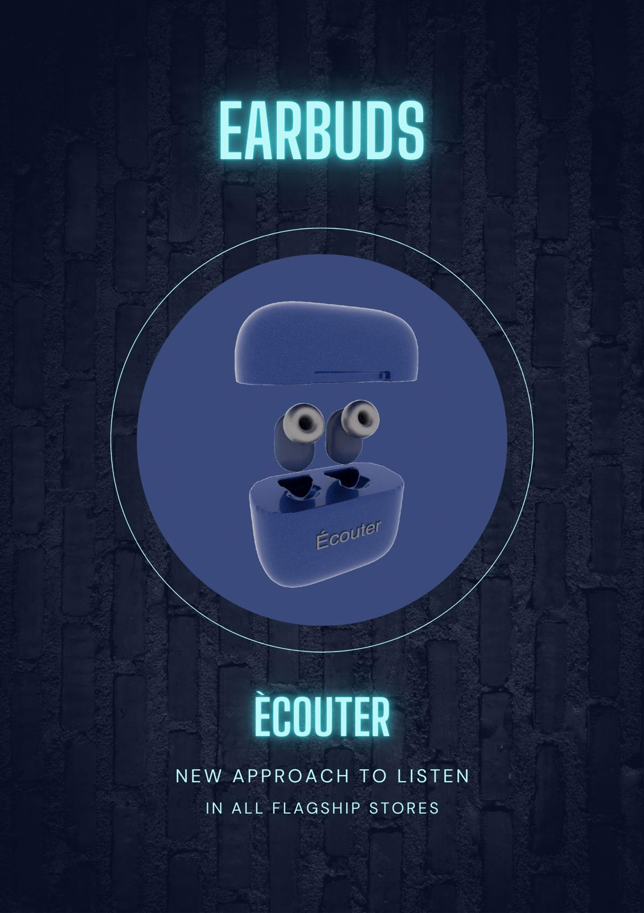
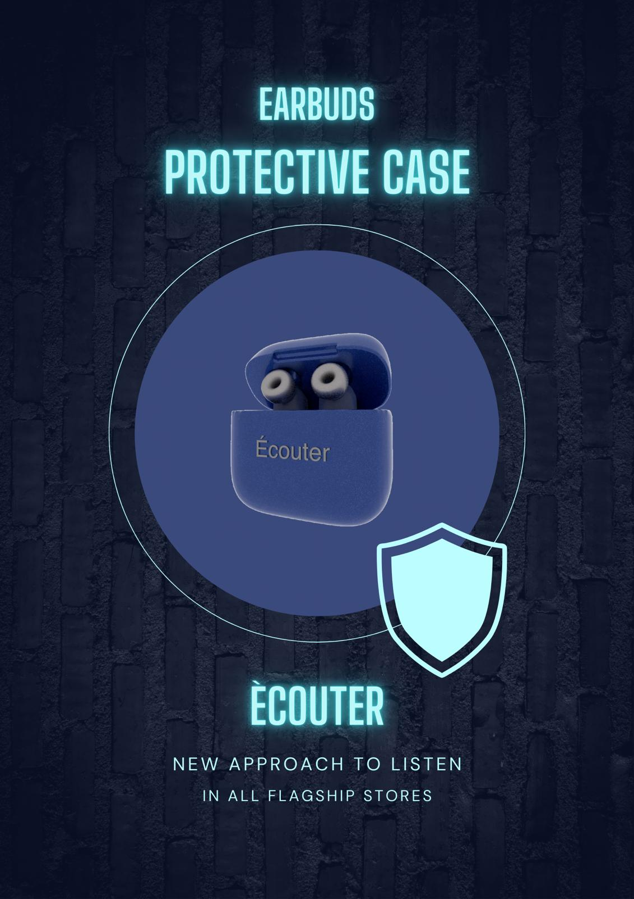

# Dina Bondarchuk Earbuds Page

This repository shows the promotional webpage of my customize earbuds.

Contextual Considerations: for mobile, tablet and desktop I want my 3d model of earbuds to be visible, but I'll adjust the sizes using "media" query in css and use a "click" event function in js, so the hotspots will be visible on mobile and tablet versions.

## Installation

This is no installatin required, but should be opened with live server.

## Usage

Open index.html in the browser of your choice.

## Contributing

1. Fork it!
2. Create your feature branch: git checkout -b my-new-feature
3. Commit your changes: git commit -am 'Add some feature'
4. Push to the branch: git push origin my-new-feature
5. Submit a pull request :D

## History

November 21, 2024

## Credits

Dina Bondarchuk

## License

MIT License
